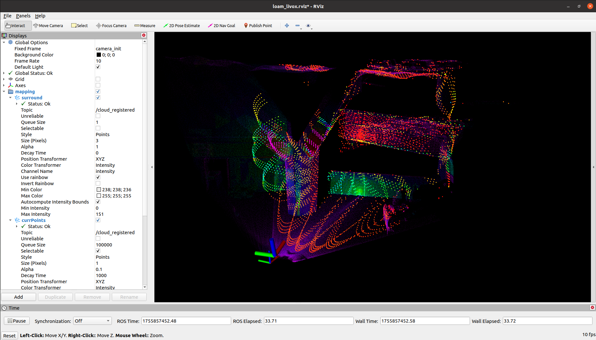

# FAST-LIO

这个仓库复现了 Fast-Lio 工程，涉及到以下源码链接：

* FAST-LIO：[https://github.com/hku-mars/FAST_LIO#](https://github.com/hku-mars/FAST_LIO#)
* Livox-SDK2：[https://github.com/Livox-SDK/Livox-SDK2](https://github.com/Livox-SDK/Livox-SDK2)
* livox_ros_driver：[https://github.com/Livox-SDK/livox_ros_driver#](https://github.com/Livox-SDK/livox_ros_driver#)

-----
# Step1. 初始化子模块

```bash
$ cd JetsonSLAM
$ git submodule update --init third_party/Livox-SDK2 
$ git submodule update --init --recursive fast_lio_project/src/FAST_LIO
$ git submodule update --init fast_lio_project/src/livox_ros_driver
```

# Step2. 安装 Livox-SDK2

```bash
$ cd JetsonSLAM
$ cd third_party/Livox-SDK2
$ mkdir build && cd build
$ cmake ..
$ make -j10
$ sudo make install 
```

# Step3. 编译 FAST_LIO 工程

如果你的终端默认启动了 conda 的 base 环境，需要在编译之前先退出环境：

```bash
$ conda deactivate 
```

执行编译命令：


```bash
$ cd JetsonSLAM/fast_lio_project
$ catkin_make
```

# Step4. 运行示例

你需要准备一份 rosbag 包，可以通过 Mars 团队提供的 [下载链接](https://drive.google.com/drive/folders/1CGYEJ9-wWjr8INyan6q1BZz_5VtGB-fP)，也可以从我的 [网盘](https://pan.baidu.com/s/1Me3C7hdvkGoDXs1pxA7UpQ?pwd=2n5w) 中下载。这里以我网盘中的资源 `CBD_Building_01.bag` 为例。

在启动脚本之前建议确认一下配置文件中 `pcd_save_en` 参数是否为 `true`，不同的 launch 会加载不同的配置文件，例如 `mapping_mid360.launch` 加载 `config/mid360.yaml`：

```yaml
pcd_save:
    pcd_save_en: true
    interval: -1                 # how many LiDAR frames saved in each pcd file; 
                                 # -1 : all frames will be saved in ONE pcd file, may lead to memory crash when having too much frames.
```


尽管官方提供的数据包是使用 Avia 设备采集的，但也可以用 Mid360 的脚本启动：

```bash
$ cd JetsonSLAM
$ cd fast_lio_project/
$ source devel/setup.bash
$ roslaunch fast_lio mapping_mid360.launch 
```



完成建图后 **终止终端程序后** 点云文件会保存到 `PCD/scans.pcd` 路径，如果不终止建图节点，该文件不会更新。