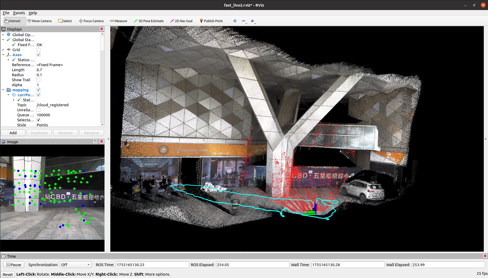

# Fast-Livo2

这个仓库复现了 Fast-Livo2 工程，涉及到以下源码链接：

* Fast-Livo2: [https://github.com/hku-mars/FAST-LIVO2](https://github.com/hku-mars/FAST-LIVO2)
* Sophus: [https://github.com/strasdat/Sophus](https://github.com/strasdat/Sophus)
* RPG Vikit: [https://github.com/xuankuzcr/rpg_vikit](https://github.com/xuankuzcr/rpg_vikit)


# Step1. 初始化子模块

```bash
$ cd JetsonSLAM
$ git submodule update --init third_party/Sophus
$ git submodule update --init fast_livo2_project/src/FAST-LIVO2
$ git submodule update --init fast_livo2_project/src/rpg_vikit
```

# Step2. 安装 Sophus 

```bash
$ cd JetsonSLAM
$ cd third_party/Sophus
$ git checkout a621ff
$ mkdir build && cd build && cmake ..
$ make 
$ sudo make install 
```

如果你在编译过程中遇到了如下报错：

```bash
/home/orin/Documents/JetsonSLAM/third_party/Sophus/sophus/so2.cpp:32:26: error: lvalue required as left operand of assignment
   32 |   unit_complex_.real() = 1.;
      |                          ^~
/home/orin/Documents/JetsonSLAM/third_party/Sophus/sophus/so2.cpp:33:26: error: lvalue required as left operand of assignment
   33 |   unit_complex_.imag() = 0.;
```

修改文件 `JetsonSLAM/Sophus/sophus/so2.cpp` 内容如下：

```cpp
SO2::SO2()
{
  // unit_complex_.real() = 1.;
  // unit_complex_.imag() = 0.;

  unit_complex_.real(1.);
  unit_complex_.imag(0.);
}
```

修改完后重新执行编译命令：

```bash
$ make 
$ sudo make install
```

----
# Step3. 编译 OpenCV 4.2.0 

由于 Fast-LIVO2 最高只支持到 OpenCV-4.2.0 版本，如果使用下面命令发现当前安装的版本高于这个版，那么需要额外编译一版 OpenCV：

```bash
$ jetson_release 
Software part of jetson-stats 4.3.2 - (c) 2024, Raffaello Bonghi
Jetpack missing!
 - Model: Jetson AGX Orin Developer Kit
 - L4T: 35.6.2
NV Power Mode[0]: MAXN
Serial Number: [XXX Show with: jetson_release -s XXX]
Hardware:
 - P-Number: p3701-0005
 - Module: NVIDIA Jetson AGX Orin (64GB ram)
Platform:
 - Distribution: Ubuntu 20.04 focal
 - Release: 5.10.216-tegra
jtop:
 - Version: 4.3.2
 - Service: Active
Libraries:
 - CUDA: 11.4.315
 - cuDNN: 8.6.0.166
 - TensorRT: 8.5.2.2
 - VPI: 2.4.8
 - Vulkan: 1.3.204
 - OpenCV: 4.5.4 - with CUDA: YES
```

## 3.1 方式一：下载二进制文件

如果你的 `jetson_release` 命令输出和上方内容基本一致，主要检查以下字段是否相同：

* Module: NVIDIA Jetson AGX Orin (64GB ram)
* Distribution: Ubuntu 20.04 focal
* CUDA: 11.4.315
* cuDNN: 8.6.0.166
* TensorRT: 8.5.2.2

那么可以直接从下面网盘中下载已经编译好的文件：

```bash
https://pan.baidu.com/s/1nIBZoz2aIX9HakQI_pjKFA?pwd=5fp3
```

将下载好的 `opencv-4.2.0.zip` 文件移动到 `JetsonSLAM/third_party` 目录下并解压：

```bash
$ mv opencv-4.2.0.zip JetsonSLAM/third_party
$ cd JetsonSLAM/thrid_party
$ unzip opencv-4.2.0.zip
```

## 3.2 方式二：源码编译

* 安装依赖库：

```bash
$ sudo apt-get install ccache
$ sudo apt-get install libgflags-dev 
$ sudo apt-get install libgoogle-glog-dev liblmdb-dev
$ sudo apt-get install libleptonica-dev

$ pip install "numpy<2.0"
```

* 初始化子模块：

```bash
$ cd JetsonSLAM
$ git submodule update --init third_party/opencv-4.2.0/
$ git submodule update --init third_party/opencv_contrib-4.2.0/
```

* 切换分支：

```bash
$ cd JetsonSLAM
$ cd third_party/opencv-4.2.0/
$ git checkout 4.2.0

$ cd ..
$ cd opencv_contrib-4.2.0/
$ git checkout 4.2.0
```

为了能充分利用 CUDA 加速 OpenCV，使用下面的命令编译源码，这个过程大概需要消耗 30 分钟左右：

【Note】：为了不干扰系统环境中默认的 OpenCV 库，在执行完编译操作后 <font color=red>**不要执行**</font> `sudo make instlal`。

```bash
$ cd JetsonSLAM
$ cd third_party/opencv-4.2.0/
$ mkdir build && cd build
$ cmake \
-DCMAKE_BUILD_TYPE=Release \
-DCMAKE_INSTALL_PREFIX=/usr/local \
-DOPENCV_ENABLE_NONFREE=1 \
-DBUILD_opencv_python2=1 \
-DBUILD_opencv_python3=1 \
-DWITH_FFMPEG=1 \
-DCUDA_TOOLKIT_ROOT_DIR=/usr/local/cuda \
-DCUDA_ARCH_BIN=8.7 \
-DCUDA_ARCH_PTX=8.7 \
-DWITH_CUDA=1 \
-DENABLE_FAST_MATH=1 \
-DCUDA_FAST_MATH=1 \
-DWITH_CUBLAS=1 \
-DOPENCV_GENERATE_PKGCONFIG=1 \
-DOPENCV_EXTRA_MODULES_PATH=../../opencv_contrib-4.2.0/modules \
-DCUDA_nppicom_LIBRARY=stdc++ \
..

$ make -j10
```

# Step4. 修改源码

你需要修改的文件一共有三分，依次找到对应文件并修改它们。

* `fast_livo2_project/src/rpg_vikit/vikit_common/CMakeLists.txt` 第 30 行附近：

```cmake
# add: 手动配置 OpenCV 库路径
SET(OpenCV_DIR "/home/orin/JetsonSLAM/third_party/opencv-4.2.0/build")
message(STATUS "Found OpenCV version: ${OpenCV_VERSION}")

# Add plain cmake packages 
FIND_PACKAGE(OpenCV REQUIRED)
FIND_PACKAGE(Eigen REQUIRED)
FIND_PACKAGE(Sophus REQUIRED)
```

* `fast_livo2_project/src/rpg_vikit/vikit_ros/CMakeLists.txt` 第 20 行附近：

```cmake
# add: 手动配置 OpenCV 库路径
SET(OpenCV_DIR "/home/orin/JetsonSLAM/third_party/opencv-4.2.0/build")
message(STATUS "Found OpenCV version: ${OpenCV_VERSION}")

# Add plain cmake packages 
FIND_PACKAGE(OpenCV REQUIRED)
FIND_PACKAGE(Eigen REQUIRED)
FIND_PACKAGE(Sophus REQUIRED)
```

* `fast_livo2_project/src/FAST-LIVO2/CMakeLists.txt` 第 3 行附近：

```cmake
cmake_minimum_required(VERSION 2.8.3)
project(fast_livo)

# add: 手动配置 OpenCV 库路径
SET(OpenCV_DIR "/home/orin/JetsonSLAM/third_party/opencv-4.2.0/build")
message(STATUS "Found OpenCV version: ${OpenCV_VERSION}")
```

# Step5. 编译工程

如果你的终端默认启动了 conda 的 base 环境，需要在编译之前先退出环境：

```bash
$ conda deactivate 
```

执行编译：

```bash
$ cd JetsonSLAM
$ cd fast_livo2_project
$ catkin_make
```

# Step6. 运行示例

修改配置文件 `fast_livo2_project/src/FAST-LIVO2/config/avia.yaml` 用以保存地图，否则将无法保存地图：

```yaml
pcd_save:
  pcd_save_en: true  # false
  colmap_output_en: true # false
  filter_size_pcd: 0.15
  interval: -1
```

运行建图节点：

```bash
$ cd JetsonSLAM
$ cd fast_livo2_project
$ source devel/setup.bash
$ roslaunch fast_livo mapping_avia.launch
```

你可以在 Fast-Livo2 官方仓库中提供的 [数据集](https://connecthkuhk-my.sharepoint.com/personal/zhengcr_connect_hku_hk/_layouts/15/onedrive.aspx?id=%2Fpersonal%2Fzhengcr%5Fconnect%5Fhku%5Fhk%2FDocuments%2Ffast%2Dlivo2%2Ddataset&ga=1) 样本中下载一个示例，或者在我的网盘中拉取 `CBD_Building_01.bag` 数据包：

```bash
https://pan.baidu.com/s/1nIBZoz2aIX9HakQI_pjKFA?pwd=5fp3
```

播放数据包：

```bash
$ rosbag play CBD_Building_01.bag
```



当建图完成并关闭建图终端后，你会在 `fast_livo2_project/src/FAST-LIVO2/Log/PCD` 路径下得到一个名为 `all_downsampled_points.pcd` 点云地图：

```bash
$ cd JetsonSLAM
$ ll fast_livo2_project/src/FAST-LIVO2/Log/PCD

total 258M
drwxrwxr-x 2 orin orin 4.0K Aug 14 18:05 ./
drwxrwxr-x 5 orin orin 4.0K Aug 14 17:49 ../
-rw-r--r-- 1 orin orin 1.9M Aug 14 18:05 all_downsampled_points.pcd
-rw-r--r-- 1 orin orin 256M Aug 14 18:05 all_raw_points.pcd
-rw-rw-r-- 1 orin orin    0 Aug 14 16:32 .gitkeep
```