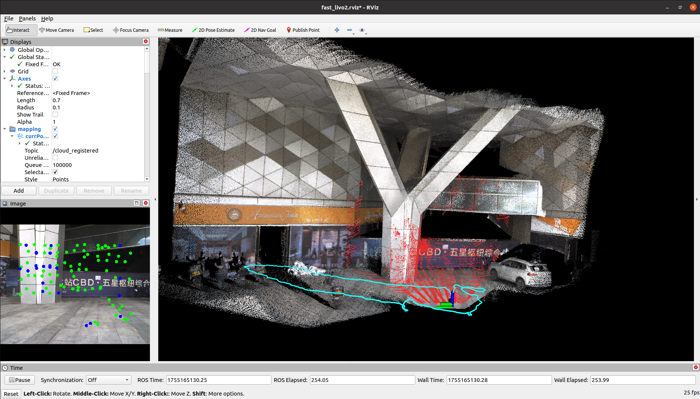

# Fast-Livo2

This repository replicates the Fast-Livo2 project, including the following source code links:

* Fast-Livo2: [https://github.com/hku-mars/FAST-LIVO2](https://github.com/hku-mars/FAST-LIVO2)
* Sophus: [https://github.com/strasdat/Sophus](https://github.com/strasdat/Sophus)
* RPG Vikit: [https://github.com/xuankuzcr/rpg_vikit](https://github.com/xuankuzcr/rpg_vikit)

# Step 1. Initialize the submodule

```bash
$ cd JetsonSLAM
$ git submodule update --init third_party/Sophus
$ git submodule update --init fast_livo2_project/src/FAST-LIVO2
$ git submodule update --init fast_livo2_project/src/rpg_vikit
```

# Step 2. Install Sophus

```bash
$ cd JetsonSLAM
$ cd third_party/Sophus
$ git checkout a621ff
$ mkdir build && cd build && cmake ..
$ make
$ sudo make install
```

If you encounter the following error during compilation:

```bash
/home/orin/Documents/JetsonSLAM/third_party/Sophus/sophus/so2.cpp:32:26: error: lvalue required as left operand of assignment
32 | unit_complex_.real() = 1.;
| ^~
/home/orin/Documents/JetsonSLAM/third_party/Sophus/sophus/so2.cpp:33:26: error: lvalue required as left operand of assignment
33 | unit_complex_.imag() = 0.;
```

Modify the `JetsonSLAM/Sophus/sophus/so2.cpp` file to the following:

```cpp
SO2::SO2()
{
// unit_complex_.real() = 1.;
// unit_complex_.imag() = 0.;

unit_complex_.real(1.);
unit_complex_.imag(0.);
}
```

After making the changes, re-execute the compilation command:

```bash
$ make
$ sudo make install
```

----
# Step 3. Compile OpenCV 4.2.0

Since Fast-LIVO2 only supports OpenCV 4.2.0, if you run the following command and find that the currently installed version is higher than this, you will need to compile an additional version of OpenCV:

```bash
$ jetson_release
Software part of jetson-stats 4.3.2 - (c) 2024, Raffaello Bonghi
Jetpack missing! 
- Model: Jetson AGX Orin Developer Kit 
- L4T: 35.6.2
NV Power Mode[0]: MAXN
Serial Number: [XXX Show with: jetson_release -s XXX]
Hardware: 
-P-Number: p3701-0005 
- Module: NVIDIA Jetson AGX Orin (64GB ram)
Platform: 
- Distribution: Ubuntu 20.04 focal 
- Release: 5.10.216-tegra
jtop: 
- Version: 4.3.2 
- Service: Active
Libraries: 
- CUDA: 11.4.315 
- cuDNN: 8.6.0.166 
- TensorRT: 8.5.2.2 
-VPI: 2.4.8
- Vulkan: 1.3.204
- OpenCV: 4.5.4 - with CUDA: YES
```

## 3.1 Method 1: Download the binary file

If the output of your `jetson_release` command is basically the same as above, check that the following fields are the same:

* Module: NVIDIA Jetson AGX Orin (64GB RAM)
* Distribution: Ubuntu 20.04 focal
* CUDA: 11.4.315
* cuDNN: 8.6.0.166
* TensorRT: 8.5.2.2

You can download the compiled files directly from the following network drive:

```bash
https://pan.baidu.com/s/1nIBZoz2aIX9HakQI_pjKFA?pwd=5fp3
```

Download the downloaded Move the `opencv-4.2.0.zip` file to the `JetsonSLAM/third_party` directory and unzip it:

```bash
$ mv opencv-4.2.0.zip JetsonSLAM/third_party
$ cd JetsonSLAM/thrid_party
$ unzip opencv-4.2.0.zip
```

## 3.2 Method 2: Compile from Source

* Install dependent libraries:

```bash
$ sudo apt-get install ccache
$ sudo apt-get install libgflags-dev
$ sudo apt-get install libgoogle-glog-dev liblmdb-dev
$ sudo apt-get install libleptonica-dev
```

* Initialize the submodule:

```bash
$ cd JetsonSLAM
$ git submodule update --init third_party/opencv-4.2.0/
$ git submodule update --init third_party/opencv_contrib-4.2.0/
```

* Switch branches:

```bash
$ cd JetsonSLAM
$ cd third_party/opencv-4.2.0/
$ git checkout 4.2.0

$ cd ..
$ cd opencv_contrib-4.2.0/
$ git checkout 4.2.0
```

To fully utilize CUDA-accelerated OpenCV, compile the source code using the following command. This process takes approximately 30 minutes:

[Note]: To avoid interfering with the default OpenCV library in your system, do not execute `sudo make install` after compiling.

```bash
$ cd JetsonSLAM
$ cd third_party/opencv-4.2.0/
$ mkdir build && cd build
$cmake\
-DCMAKE_BUILD_TYPE=Release \
-DCMAKE_INSTALL_PREFIX=/usr/local \
-DOPENCV_ENABLE_NONFREE=1 \
-DBUILD_opencv_python2=1 \
-DBUILD_opencv_python3=1 \
-DWITH_FFMPEG=1 \
-DCUDA_TOOLKIT_ROOT_DIR=/usr/local/cuda \
-DCUDA_ARCH_BIN=8.7 \
-DCUDA_ARCH_PTX=8.7 \
-DWITH_CUDA=1 \
-DENABLE_FAST_MATH=1 \
-DCUDA_FAST_MATH=1 \
-DWITH_CUBLAS=1 \
-DOPENCV_GENERATE_PKGCONFIG=1 \
-DOPENCV_EXTRA_MODULES_PATH=../../opencv_contrib-4.2.0/modules \
-DCUDA_nppicom_LIBRARY=stdc++ \
..

$ make -j10
```

# Step 4. Modify the source code

There are three files you need to modify. Find the corresponding files and modify them one by one.

* `fast_livo2_project/src/rpg_vikit/vikit_common/CMakeLists.txt` around line 30:

```cmake
# add: Manually configure the OpenCV library path
SET(OpenCV_DIR "/home/orin/JetsonSLAM/third_party/opencv-4.2.0/build")
message(STATUS "Found OpenCV version: ${OpenCV_VERSION}")

# Add plain CMake packages
FIND_PACKAGE(OpenCV REQUIRED)
FIND_PACKAGE(Eigen REQUIRED)
FIND_PACKAGE(Sophus REQUIRED)
```

* `fast_livo2_project/src/rpg_vikit/vikit_ros/CMakeLists.txt` around line 20:

```cmake
# add: Manually configure OpenCV Library Path
SET(OpenCV_DIR "/home/orin/JetsonSLAM/third_party/opencv-4.2.0/build")
message(STATUS "Found OpenCV version: ${OpenCV_VERSION}")

# Add plain CMake packages
FIND_PACKAGE(OpenCV REQUIRED)
FIND_PACKAGE(Eigen REQUIRED)
FIND_PACKAGE(Sophus REQUIRED)
```

* Around line 3 of `fast_livo2_project/src/FAST-LIVO2/CMakeLists.txt`:

```cmake
cmake_minimum_required(VERSION 2.8.3)
project(fast_livo)

# Add: Manually configure the OpenCV library path
SET(OpenCV_DIR "/home/orin/JetsonSLAM/third_party/opencv-4.2.0/build")
message(STATUS "Found OpenCV version: ${OpenCV_VERSION}")
```

# Step 5. Compile the project

If your terminal defaults to the conda base environment, you need to exit it before compiling:

```bash
$ conda deactivate
```

Compile:

```bash
$ cd JetsonSLAM
$ cd fast_livo2_project
$ catkin_make
```

# Step 6. Run the example

```bash
$ cd JetsonSLAM
$ cd fast_livo2_project
$ source devel/setup.bash
$ roslaunch fast_livo mapping_avia.launch
```

You can download an example from the dataset samples provided in the Fast-Livo2 official repository, or pull the `CBD_Building_01.bag` data package from my network drive:

* [FAST-LIVO2-Dataset](https://connecthkuhk-my.sharepoint.com/personal/zhengcr_connect_hku_hk/_layouts/15/onedrive.aspx?id=%2Fpersonal%2Fzhengcr%5Fconnect%5Fhku%5Fhk%2FDocuments%2Ffast%2Dlivo2%2Ddataset&ga=1)

```bash
https://pan.baidu.com/s/1nIBZoz2aIX9HakQI_pjKFA?pwd=5fp3
```

Play the data package:

```bash
$ rosbag play CBD_Building_01.bag
```

