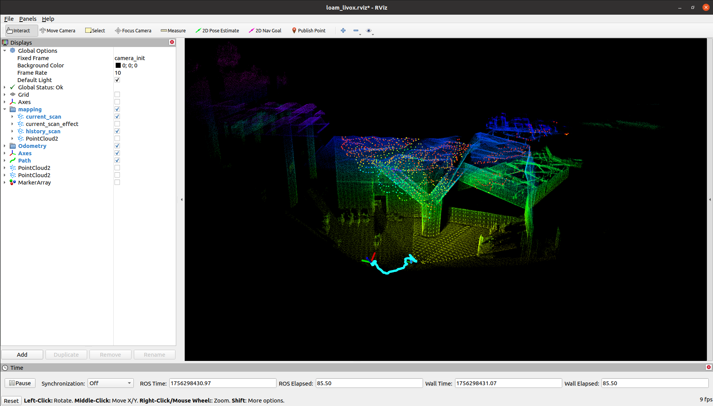

# Faster-LIO

这个仓库复现了 Faster-Lio 工程，涉及到以下源码链接：

* Faster-LIO: [https://github.com/gaoxiang12/faster-lio#](https://github.com/gaoxiang12/faster-lio#)

总体而言该工程在编译上没有特殊需要注意的地方，整体流程按照官方步骤一步一步执行即可。

----
# Step1. 初始化子模块

```bash
$ cd JetsonSLAM
$ git submodule update --init faster_lio_project/src/faster-lio/
```

----
# Step2. 安装依赖

```bash
$ sudo apt-get install libgoogle-glog-dev
$ sudo apt-get install libeigen3-dev
$ sudo apt-get install libpcl-dev
$ sudo apt-get install libyaml-cpp-dev
```

----
# Step3. 编译工程

```bash
$ cd JetsonSLAM
$ cd faster_lio_project

$ catkin_make
```

-----
# Step4. 运行示例

```bash
$ cd JetsonSLAM/faster_lio_project
$ source devel/setup.bash 
$ roslaunch faster_lio mapping_avia.launch
```

你可以在 Fast-Livo2 官方仓库中提供的 [数据集](https://connecthkuhk-my.sharepoint.com/personal/zhengcr_connect_hku_hk/_layouts/15/onedrive.aspx?id=%2Fpersonal%2Fzhengcr%5Fconnect%5Fhku%5Fhk%2FDocuments%2Ffast%2Dlivo2%2Ddataset&ga=1) 样本中下载一个示例，或者在我的网盘中拉取 `CBD_Building_01.bag` 数据包：

```bash
https://pan.baidu.com/s/1nIBZoz2aIX9HakQI_pjKFA?pwd=5fp3
```

在运行之前需要检查 launch 文件对应的配置文件，例如这里使用的是 `launch/mapping_avia.launch`，那么需要检查的配置文件是 `config/avia.yaml`：

```yaml
pcd_save:
  pcd_save_en: true     # 确保该值为 true，否则地图无法保存
  interval: -1
```

* 播放数据包：

```bash
$ rosbag play CBD_Building_01.bag
```


