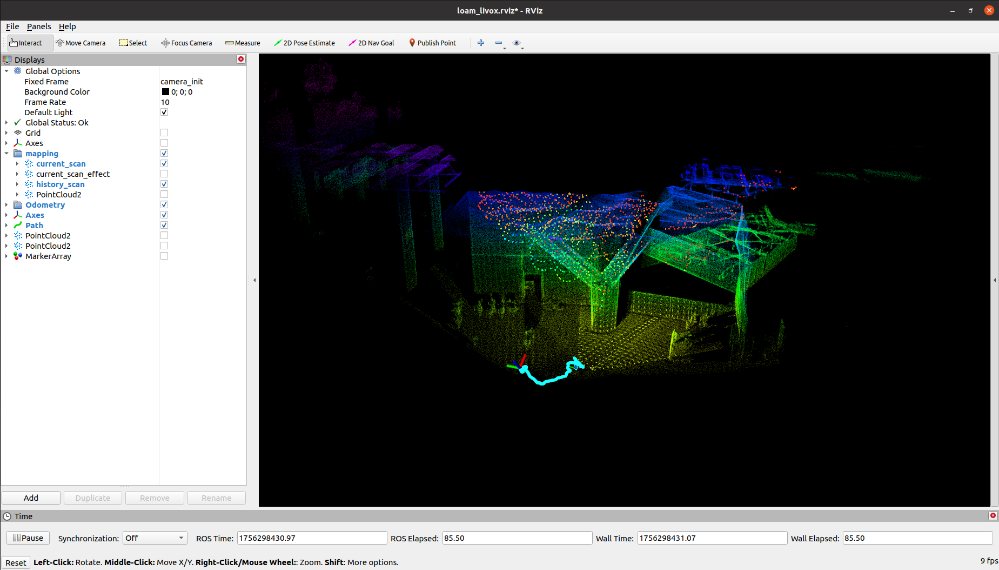

# Faster-LIO

This repository replicates the Faster-Lio project, including the following source code links:

* Faster-LIO: [https://github.com/gaoxiang12/faster-lio#](https://github.com/gaoxiang12/faster-lio#)

Overall, there are no special compilation requirements for this project; simply follow the official instructions step by step.

----
# Step 1. Initialize the submodule

```bash
$ cd JetsonSLAM
$ git submodule update --init faster_lio_project/src/faster-lio/
```

----
# Step 2. Install dependencies

```bash
$ sudo apt-get install libgoogle-glog-dev
$ sudo apt-get install libeigen3-dev
$ sudo apt-get install libpcl-dev
$ sudo apt-get install libyaml-cpp-dev
```

----
# Step 3. Compile the project

```bash
$ cd JetsonSLAM
$ cd faster_lio_project

$ catkin_make
```

-----
# Step 4. Run the example

```bash
$ cd JetsonSLAM/faster_lio_project
$ source devel/setup.bash
$ roslaunch faster_lio mapping_avia.launch
```

You can download an example from the [dataset](https://connecthkuhk-my.sharepoint.com/personal/zhengcr_connect_hku_hk/_layouts/15/onedrive.aspx?id=%2Fpersonal%2Fzhengcr%5Fconnect%5Fhku%5Fhk%2FDocuments%2Ffast%2Dlivo2%2Ddataset&ga=1) sample provided in the Fast-Livo2 official repository, or download the `CBD_Building_01.bag` data package from my network drive:

```bash
https://pan.baidu.com/s/1nIBZoz2aIX9HakQI_pjKFA?pwd=5fp3
```

Before running, you need to check the configuration file corresponding to the launch file. For example, here we use `launch/mapping_avia.launch`, so the configuration file to check is `config/avia.yaml`:

```yaml
pcd_save:
pcd_save_en: true # Ensure this value is true, otherwise the map will not be saved.
interval: -1
```

* Play data package:

```bash
$ rosbag play CBD_Building_01.bag
```

