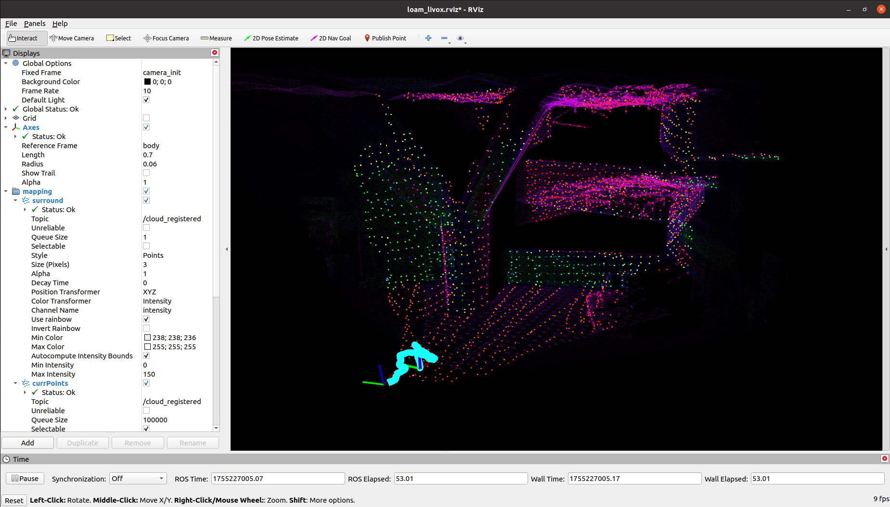

# Point-LIO

This repository replicates the Point-LIO project and includes the following source code links:

* Point-LIO: [https://github.com/hku-mars/Point-LIO#](https://github.com/hku-mars/Point-LIO#);
* livox_ros_driver: [https://github.com/Livox-SDK/livox_ros_driver#](https://github.com/Livox-SDK/livox_ros_driver#);

----
# Step 1. Initialize the submodule

```bash
$ cd JetsonSLAM
$ git submodule update --init --recursive point_lio_project/src/Point-LIO/
$ git submodule update --init point_lio_project/src/livox_ros_driver/
```

# Step 2. Install dependent libraries

```bash
$ sudo apt-get install ros-$ROS_DISTRO-pcl-conversions
$ sudo apt-get install libeigen3-dev
```

# Step 3. Compile the source code

If your terminal has the conda base environment enabled by default, it is recommended to exit before compiling:

```bash
$ conda deactivate
```

Compile:

```bash
$ cd JetsonSLAM/point_lio_project
$ catkin_make
```

# Step 4. Run the example

* Modify the configuration file `point_lio_project/src/Point-LIO/config/avia.yaml` to save the map; otherwise, the map will not be saved:

```yaml
pcd_save:
pcd_save_en: true # false
interval: -1
```

* Run the map generation node:

```bash
$ cd JetsonSLAM
$ cd point_lio_project
$ source devel/setup.bash
$ roslaunch point_lio mapping_avia.launch
```

You can download an example from the [dataset](https://connecthkuhk-my.sharepoint.com/personal/zhengcr_connect_hku_hk/_layouts/15/onedrive.aspx?id=%2Fpersonal%2Fzhengcr%5Fconnect%5Fhku%5Fhk%2FDocuments%2Ffast%2Dlivo2%2Ddataset&ga=1) sample provided in the Fast-Livo2 official repository, or download the `CBD_Building_01.bag` data package from my network drive:

```bash
https://pan.baidu.com/s/1nIBZoz2aIX9HakQI_pjKFA?pwd=5fp3
```

* Play the data package:

```bash
$ rosbag play CBD_Building_01.bag
```

