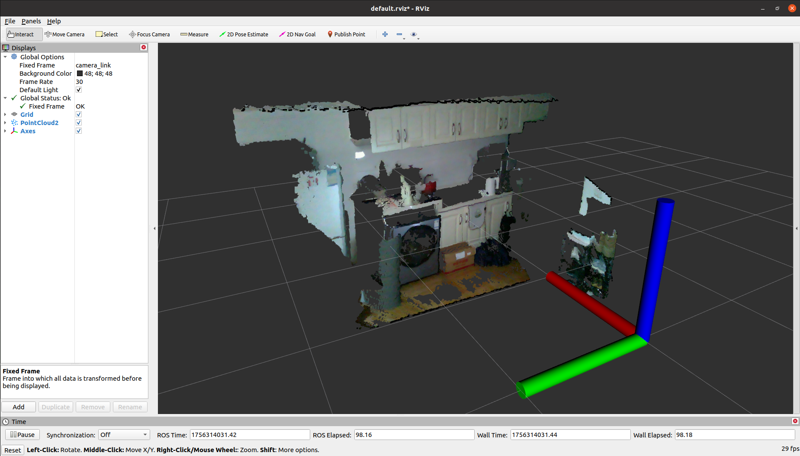

# Voxel Map

This project implements the compilation and running of the `Voxel Map` project on the Nvidia Jetson hardware platform. The overall effect is shown in the figure below:

这个工程实现了在 Nvidia Jetson 硬件平台上编译与运行 `Voxel Map` 工程，整体效果如下图所示：

* Voxel Map: [https://github.com/hku-mars/VoxelMap.git](https://github.com/hku-mars/VoxelMap.git)

We provide the following language versions of the ReadMe file to help you quickly familiarize yourself with this project. Click the hyperlink below to jump:

我们提供了以下语言版本的 ReadMe 文件以帮助你快速熟悉这个工程，点击下方超链接进行跳转：

* [README-CN](./resources//ReadMe-CN.md)：简体中文；
* [README-EN](./resources//ReadMe-EN.md)：English-US；
