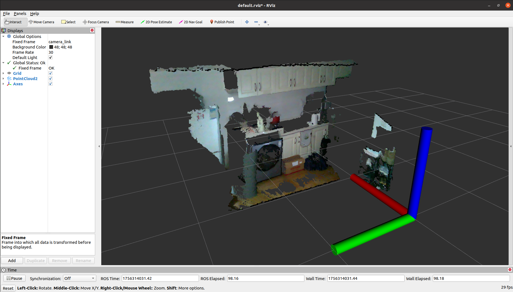

# Voxel Map

这个仓库复现了 VoxelMap 工程，涉及到以下源码链接：

* VoxelMap: [https://github.com/hku-mars/VoxelMap?tab=readme-ov-file#](https://github.com/hku-mars/VoxelMap?tab=readme-ov-file#)
* livox_ros_driver: [https://github.com/Livox-SDK/livox_ros_driver#](https://github.com/Livox-SDK/livox_ros_driver#)
* librealsense: [https://github.com/IntelRealSense/librealsense](https://github.com/IntelRealSense/librealsense)
* realsense-ros: [https://github.com/IntelRealSense/realsense-ros#](https://github.com/IntelRealSense/realsense-ros#)

总体而言该工程在编译上没有特殊需要注意的地方，整体流程按照官方步骤一步一步执行即可。

----
# Step1. 初始化子模块

```bash
$ cd JetsonSLAM
$ git submodule update --init voxel_map_project/src/VoxelMap/
$ git submodule update --init voxel_map_project/src/livox_ros_driver/
```

----
# Step2. 编译工程

```bash
$ cd JetsonSLAM
$ cd voxel_map_project

$ catkin_make
```

如果你在编译过程中遇到了有关 livox 头文件相关的报错，那么可以在编译结束后执行下面的命令并重新编译：

```bash
$ source devel/setup.bash 
$ catkin_make
```

----
# Step3. 运行示例

```bash
$ cd JetsonSLAM/voxel_map_project
$ source devel/setup.bash 
$ roslaunch voxel_map mapping_l515.launch 
```

你可以在 VoxelMap 官方仓库中提供的 [数据集](https://connecthkuhk-my.sharepoint.com/personal/ycj1_connect_hku_hk/_layouts/15/onedrive.aspx?id=%2Fpersonal%2Fycj1%5Fconnect%5Fhku%5Fhk%2FDocuments%2FL515%5Fdataset&ga=1) 样本中下载一个示例，或者在我的网盘中拉取 `l5152.bag` 数据包：

```bash
https://pan.baidu.com/s/1nIBZoz2aIX9HakQI_pjKFA?pwd=5fp3
```

【注意】：**我们发现官方仓库中提供的数据包可能存在问题，如果你在播放数据包时提示报错 `Error reading from file: wanted 4 bytes, read 0 bytes`，那么你需要使用下面的命令重置索引；如果你直接从我们的网盘中获得数据包，则不需要执行这一步。**

```bash
$ rosbag reindex l5152.bag
```


* 播放数据包：

```bash
$ rosbag play l5152.bag
```

---
# Step4. 使用自己的 L515 相机

由于 L515 折款相机已经不再维护，如果你想在该项目中使用自己的相机，那么你需要手动编译 librealsense 指定版本 `v2.50.0`。如果你计划使用 D435i 相机，则只需修改项目中配置文件中的点云话题即可。

## 4.1 拉取源码与切换分支
* 初始化仓库：
```bash
$ cd JetsonSLAM

$ git submodule update --init voxel_map_project/librealsense
$ git submodule update --init voxel_map_project/src/realsense-ros
```

* 切换 `librealsense` 指定版本：

```bash
$ cd JetsonSLAM
$ cd voxel_map_project/librealsense

$ git checkout v2.50.0
```

* 切换 `realsense-ros` 版本：

```bash
$ cd JetsonSLAM
$ cd voxel_map_project/src/realsense-ros

$ git checkout ros1-legacy
```

## 4.2 编译 librealsense

```bash
$ cd JetsonSLAM
$ cd voxel_map_project/librealsense

$ mkdir build && cd build
$ cmake ../ -DCMAKE_BUILD_TYPE=Release -DCMAKE_INSTALL_PREFIX=../install
$ make -j${nproc}
$ make install  # 不能使用 sudo make install
```

## 4.3 编译工作空间

* 修改 `realsense_ws/src/realsense-ros/realsense2_camera/CMakeLists.txt` 文件：

```cmake
# 位置一：添加 realsense2_DIR 路径，根据自己的实际路径修改
set(realsense2_DIR "/home/orin/Desktop/JetsonSLAM/voxel_map_project/librealsense/install/lib/cmake/realsense2")

# 位置二：添加 OpenCV 库
find_package(OpenCV REQUIRED)

# 位置三：添加头文件库
include_directories(
    include
    ${realsense2_INCLUDE_DIR}
    ${catkin_INCLUDE_DIRS}
    ${OpenCV_INCLUDE_DIRS}
    )

# 位置四：添加链接库
target_link_libraries(${PROJECT_NAME}
    ${realsense2_LIBRARY}
    ${catkin_LIBRARIES}
    ${CMAKE_THREAD_LIBS_INIT}
    ${OpenCV_LIBS}
    )
```

* 编译工作空间：

```bash
$ cd JetsonSLAM
$ cd voxel_map_project

$ catkin_make
```

## 4.4 使用 L515 相机

在每次启动 L515 相机之前，你需要添加环境变量，如果你计划长期使用这款相机，那么建议将环境变量直接写入到 `~/.bashrc` 文件中，如果你仅打算在这个工程中使用，则仅需在终端中添加以下环境变量：

```bash
$ export LD_LIBRARY_PATH=/home/orin/Desktop/JetsonSLAM/voxel_map_project/librealsense/install/lib:$LD_LIBRARY_PATH
```

