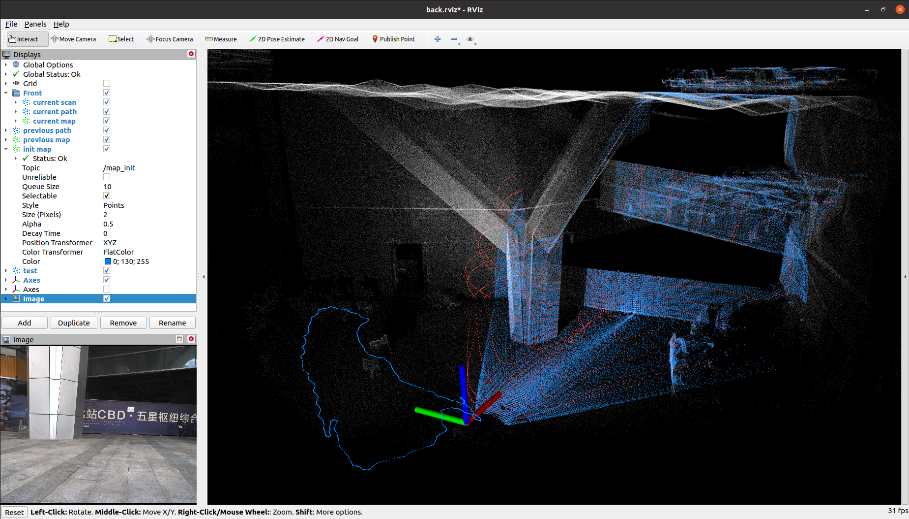

# Voxel SLAM

这个仓库复现了 Voxel-SLAM 工程，涉及到以下源码链接：

* Voxel-SLAM: [https://github.com/hku-mars/Voxel-SLAM#](https://github.com/hku-mars/Voxel-SLAM#)
* livox_ros_driver: [https://github.com/Livox-SDK/livox_ros_driver#](https://github.com/Livox-SDK/livox_ros_driver#)

总体而言该工程在编译上没有特殊需要注意的地方，整体流程按照官方步骤一步一步执行即可。

----
# Step1. 初始化子模块

```bash
$ cd JetsonSLAM
$ git submodule update --init voxel_slam_project/src/Voxel-SLAM/
$ git submodule update --init voxel_slam_project/src/livox_ros_driver/
```

----
# Step2. 编译工程

```bash
$ cd JetsonSLAM
$ cd voxel_slam_project

$ catkin_make
```

----
# Step3. 运行示例

```bash
$ cd JetsonSLAM/voxel_slam_project
$ source devel/setup.bash 
$ roslaunch voxel_slam vxlm_avia.launch 
```

你可以在 Fast-Livo2 官方仓库中提供的 [数据集](https://connecthkuhk-my.sharepoint.com/personal/zhengcr_connect_hku_hk/_layouts/15/onedrive.aspx?id=%2Fpersonal%2Fzhengcr%5Fconnect%5Fhku%5Fhk%2FDocuments%2Ffast%2Dlivo2%2Ddataset&ga=1) 样本中下载一个示例，或者在我的网盘中拉取 `CBD_Building_01.bag` 数据包：

```bash
https://pan.baidu.com/s/1nIBZoz2aIX9HakQI_pjKFA?pwd=5fp3
```

在运行之前需要检查 launch 文件对应的配置文件，例如这里使用的是 `launch/mapping_avia.launch`，那么需要检查的配置文件是 `VoxelSLAM/config/avia.yaml`：

```yaml
General:
  lid_topic: "/livox/lidar"
  imu_topic: "/livox/imu"
  # The file path of the map to be saved
  save_path: /home/orin/Desktop/JetsonSLAM/voxel_slam_project"
```

* 播放数据包：

```bash
$ rosbag play CBD_Building_01.bag
```

